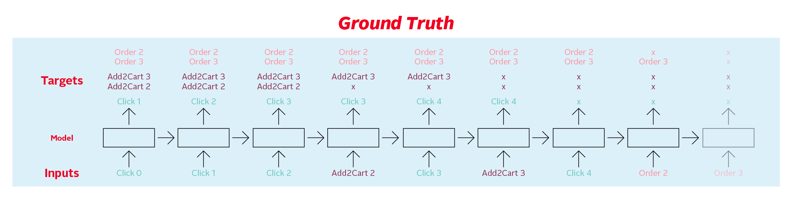

# [OTTO – Multi-Objective Recommender System](https://www.kaggle.com/competitions/otto-recommender-system)

## 1 比赛描述

### 1.1 目标

这场比赛的目标是预测电子商务点击、购物车添加和订单。您将根据用户之前的行为构建一个多目标推荐系统。你的工作将改善消费者的购物体验。
客户将收到更多个性化的推荐，而在线零售商可能会增加销售额。

### 1.2 背景

消费者可以从大型零售商那里挑选数百万种产品。虽然这种多样性可能令人印象深刻，但有如此多的选择可供探索可能会让人不知所措，导致购物者不知所措。
这既不利于寻求购买的购物者，也不利于错过销售的零售商。这也是在线零售商依靠推荐系统引导购物者购买最符合他们兴趣和动机的产品的原因之一。
使用数据科学来增强零售商预测每个客户实际想看到哪些产品、添加到购物车中以及在他们访问的任何给定时刻实时订购的能力，可以在您下次与您最喜欢的零售商
在线购物时改善您的客户体验。

目前的推荐系统由各种不同方法的模型组成，从简单的矩阵分解到 Transformer 型深度神经网络。然而，没有一个模型可以同时优化多个目标。
在本次比赛中，您将构建一个条目，根据之前的同一会话事件预测点击率、添加到购物车和转化率。

OTTO 拥有来自 19000 多个品牌的 1000 多万种产品，是德国最大的在线商店。OTTO 是总部位于汉堡的跨国奥托集团的成员，该集团还为 
Crate&Barrel（美国）和 3 Suisses（法国）提供补贴。

你的工作将帮助在线零售商从广泛的范围内选择更相关的商品，根据他们的实时行为向他们的客户推荐。改进推荐将确保浏览看似无穷无尽的选项
对购物者来说更加轻松和吸引人。

---

## 2 评估指标

对提交的材料进行评估 Recall@20 对于每种动作类型，三个 recall 值是加权平均的：

$$
    score =0.10 \cdot R_{\text {clicks }}+0.30 \cdot R_{\text {carts }}+0.60 \cdot R_{\text {orders }}
$$

其中 $R$ 被定义为：

$$
    R_{\text {type }}=\frac{\sum_{i}^{N} \mid\\{\text { predicted aids }\\}\_{i, \text { type }} \cap\\{\text { ground truth aids }\\}\_{i, \text { type }} \mid}{\sum_{i}^{N} \min \left(20, \mid\\{\text { ground truth aids }\\}_{i, type} \mid\right)}
$$

- $N$ 是测试集中的会话总数
  - $\text{predicted}$ $\text{aids}$ 是在截断前20个预测之后对每个会话类型（例如提交文件中的每一行）的预测

对于测试集中的每个会话，您的任务是预测在测试集中每个会话的最后一个时间戳之后出现的每种类型的辅助值。换句话说，测试数据包含由时间戳
截断的会话，您需要预测截断点后会发生什么。

对于点击，每个会话只有一个真实值，这是会话期间点击的下一个辅助值（尽管您仍然可以预测多达20个辅助值）。购物车和订单的基本事实包含
在会话期间分别添加到购物车和订购的所有援助值。



每个会话和类型组合都应该出现在提交中自己的 session_type 行上，预测应该用空格分隔。

---

## 3 提交结果

对于测试集中的每个会话 id 和类型组合，您必须预测标签列中的辅助值，标签列以空格分隔。每行最多可以预测 20 个辅助值。该文件应包含一个
标题，并具有以下格式：

```csv
session_type,labels
12906577_clicks,135193 129431 119318 ...
12906577_carts,135193 129431 119318 ...
12906577_orders,135193 129431 119318 ...
12906578_clicks, 135193 129431 119318 ...
etc. 
```

## 4 数据集

这场比赛的目标是预测电子商务点击、购物车添加和订单。您将基于用户会话中的先前事件构建一个多目标推荐系统。

训练数据包含**完整的电子商务会话信息**。对于测试集中的每条数据，您的任务是预测每个数据中最后一个时间戳 ts 之后出现的每种会话类型的
辅助值。换句话说，测试数据包含由时间戳截断的会话，您需要**预测截断点后会发生什么**。

- `train.jsonl`：训练数据，包含完整的会话数据
  - `session`：唯一的会话 ID
  - `events`：会话中事件的时间顺序序列
    - `aid`：相关事件的文章 ID（产品代码）
    - `ts`：事件的 Unix 时间戳
    - `type`：事件类型，即在会话中产品是否被点击、添加到购物车或被订购
- `test.jsonl`：测试数据，包含截断的会话数据
  - 您的任务是预测会话截断后下一个点击的 aid，以及剩余添加到购物车和已订购的 aids；您可以为每种会话类型预测最多 20 个值
- `sample_submission.csv`：一个格式正确的提交文件示例
